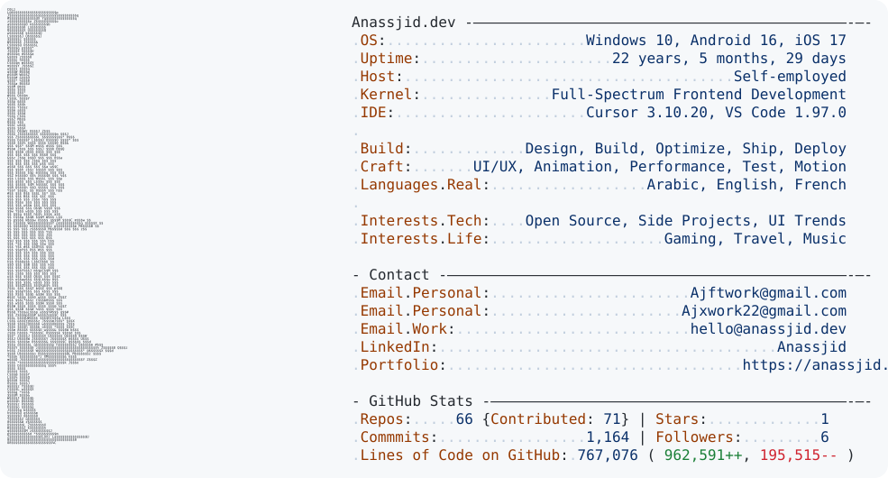

<a href="https://github.com/ajxdevx/ajxdevx">
  <picture>
    <source media="(prefers-color-scheme: dark)" srcset="dark_mode.svg">
    <source media="(prefers-color-scheme: light)" srcset="light_mode.svg">
    
  </picture>
</a>
